# Mapa de Aplicación - ChambaApp Frontend

Este documento describe el mapeo funcional y técnico del frontend de ChambaApp: módulos, rutas, dependencias internas, servicios API y flujos de comunicación entre componentes.

## 1. Vista General

ChambaApp Frontend es una SPA construida con React, Vite y React Router. La aplicación se divide en tres zonas principales:

| Zona | Responsabilidad | Archivos principales |
| --- | --- | --- |
| Bootstrap | Inicializar React, estilos globales, Datadog y captura de errores | `src/main.jsx`, `src/components/ErrorBoundary.jsx`, `src/config/datadog.js` |
| Enrutamiento y sesión | Mantener usuario, token, tema, rutas y navegación por rol | `src/App.jsx` |
| Experiencia por rol | Layouts y páginas de cliente/prestador | `src/layouts/*`, `src/pages/**` |
| Integración backend | Cliente HTTP centralizado y módulos API | `src/services/api.js` |
| Utilidades transversales | Formato, sanitización, analytics, estado estable | `src/utils/*`, `src/hooks/*` |

## 2. Diagrama de Alto Nivel

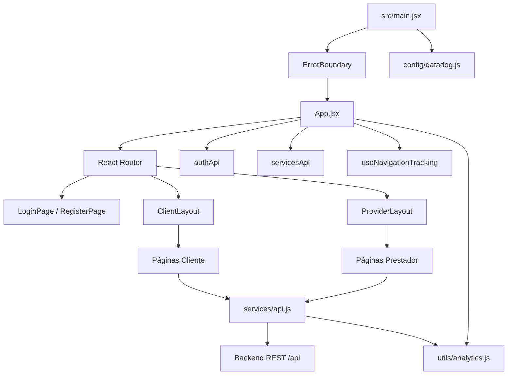

## 3. Estructura de Carpetas

```text
src/
├── main.jsx
├── App.jsx
├── App.css
├── components/
│   └── ErrorBoundary.jsx
├── config/
│   └── datadog.js
├── hooks/
│   └── useNavigationTracking.js
├── layouts/
│   ├── ClientLayout.jsx
│   └── ProviderLayout.jsx
├── pages/
│   ├── LoginPage.jsx
│   ├── RegisterPage.jsx
│   ├── ClientHomePage.jsx
│   ├── ProviderHomePage.jsx
│   ├── client/
│   └── provider/
├── services/
│   └── api.js
├── styles/
└── utils/
    ├── analytics.js
    ├── formatters.js
    ├── forms.js
    └── state.js
```

## 4. Bootstrap de la App

### `src/main.jsx`

Responsabilidades:

- Importar estilos base.
- Inicializar Datadog RUM con `initDatadogRum()`.
- Montar React en `#root`.
- Envolver la app con `ErrorBoundary`.

Relaciones:

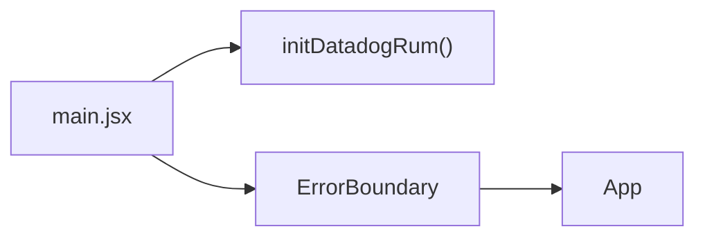

### `src/components/ErrorBoundary.jsx`

Responsabilidades:

- Capturar errores de renderizado React.
- Enviar errores a Datadog mediante `trackUnexpectedError`.
- Mostrar fallback de error recuperable.

Depende de:

- `utils/analytics.js`

## 5. Enrutamiento Principal

### `src/App.jsx`

Responsabilidades:

- Crear `BrowserRouter`.
- Definir rutas públicas y privadas.
- Mantener estado global de:
  - `user`
  - `darkMode`
  - formularios de login/register
  - catálogo inicial de servicios
- Guardar usuario y token en `localStorage`.
- Sincronizar usuario con Datadog.
- Redirigir por rol.

Depende de:

| Dependencia | Uso |
| --- | --- |
| `react-router-dom` | Rutas, navegación y redirección |
| `services/api.js` | Login, registro, catálogo |
| `config/datadog.js` | Identidad segura en Datadog |
| `hooks/useNavigationTracking.js` | Tracking de rutas |
| `utils/analytics.js` | Eventos login/register/logout |
| `utils/forms.js` | Sanitización de teléfono |
| `utils/state.js` | Evitar renders innecesarios |

## 6. Mapa de Rutas

### Rutas públicas

| Ruta | Componente | Descripción |
| --- | --- | --- |
| `/` | `Navigate` | Redirige según sesión |
| `/login` | `LoginPage` | Inicio de sesión |
| `/register` | `RegisterPage` | Registro cliente/prestador |

### Rutas cliente

Todas cuelgan de `ClientLayout`.

| Ruta | Componente | Servicios API |
| --- | --- | --- |
| `/client` | `ClientHomePage` | `categoriesApi`, `dashboardApi.client`, `authApi.profile`, `servicesApi` desde `App` |
| `/client/search` | `ClientSearchPage` | `servicesApi`, `categoriesApi`, `favoritesApi` |
| `/client/requests` | `ClientRequestsPage` | `requestsApi`, `ratingsApi`, `paymentsApi` vía modal |
| `/client/messages` | `ClientMessagesPage` | `conversationsApi` |
| `/client/favorites` | `ClientFavoritesPage` | `favoritesApi` |
| `/client/profile` | `ClientProfilePage` | `authApi`, `addressesApi` |

### Rutas prestador

Todas cuelgan de `ProviderLayout`.

| Ruta | Componente | Servicios API |
| --- | --- | --- |
| `/provider` | `ProviderHomePage` | `providerApi`, `authApi` |
| `/provider/requests` | `ProviderRequestsPage` | `providerApi.requests`, `providerApi.acceptRequest` |
| `/provider/jobs` | `ProviderJobsPage` | `providerApi.jobs`, `providerApi.updateJobStatus` |
| `/provider/calendar` | `ProviderCalendarPage` | `providerApi.calendar` |
| `/provider/messages` | `ProviderMessagesPage` | `conversationsApi` |
| `/provider/earnings` | `ProviderEarningsPage` | `providerApi.earnings`, `providerApi.transactions` |
| `/provider/reviews` | `ProviderReviewsPage` | `providerApi.reviews` |
| `/provider/profile` | `ProviderProfilePage` | `authApi.profile`, `providerApi.updateProfile` |
| `/provider/services` | `ProviderServicesPage` | `authApi`, `servicesApi`, `categoriesApi` |

## 7. Layouts

### `ClientLayout.jsx`

Responsabilidades:

- Menú lateral del cliente.
- Contenedor visual de rutas cliente.
- Indicadores de solicitudes y mensajes no leídos.
- Polling de:
  - `dashboardApi.client()`
  - `conversationsApi.getAll()`
  - `notificationsApi.getAll()`
- Toast de nuevos mensajes/notificaciones.
- Propaga contexto a páginas hijas mediante `Outlet`.

Relaciones:

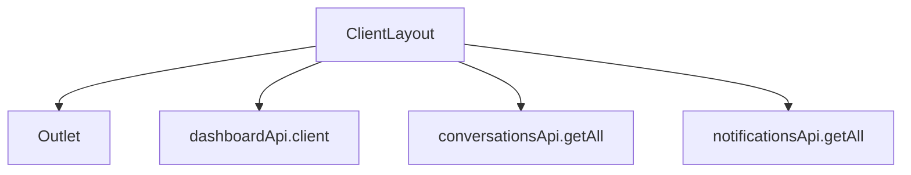

### `ProviderLayout.jsx`

Responsabilidades:

- Menú lateral del prestador.
- Indicadores de solicitudes pendientes y mensajes no leídos.
- Polling de:
  - `providerApi.dashboard()`
  - `conversationsApi.getAll()`
  - `notificationsApi.getAll()`
- Toast de nuevos mensajes/notificaciones.

Relaciones:

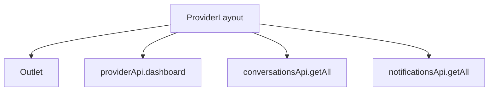

## 8. Módulos Cliente

### `ClientHomePage.jsx`

Responsabilidad:

- Dashboard de cliente.
- Categorías populares.
- Servicios cercanos.
- Próximas solicitudes.
- Abre `RequestServiceModal`.

Referencias:

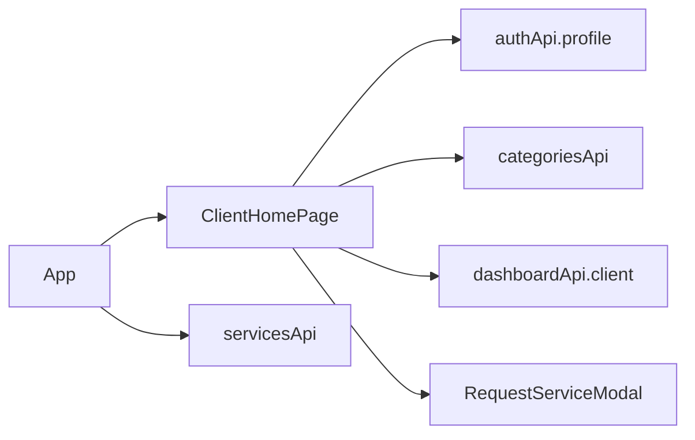

### `ClientSearchPage.jsx`

Responsabilidad:

- Búsqueda de servicios.
- Filtrado por categoría.
- Ordenamiento.
- Agregar prestador a favoritos.
- Solicitar servicio.

Referencias:

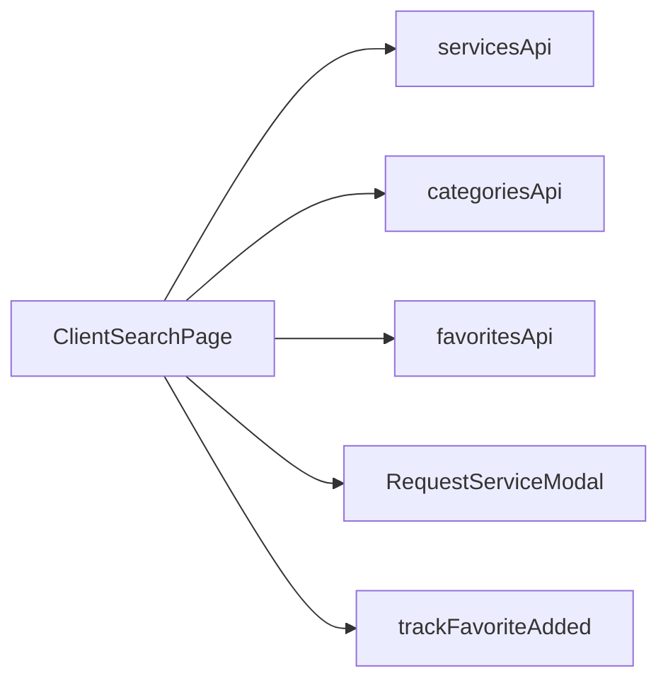

### `ClientRequestsPage.jsx`

Responsabilidad:

- Historial de solicitudes del cliente.
- Cancelar solicitud.
- Reprogramar visita.
- Aceptar fecha propuesta.
- Pagar solicitud.
- Calificar servicio.

Componentes relacionados:

| Componente | Uso |
| --- | --- |
| `PaymentModal` | Registrar y confirmar pago |
| `RequestDateModal` | Reprogramar solicitud |
| `ReviewModal` | Enviar reseña |

Referencias:

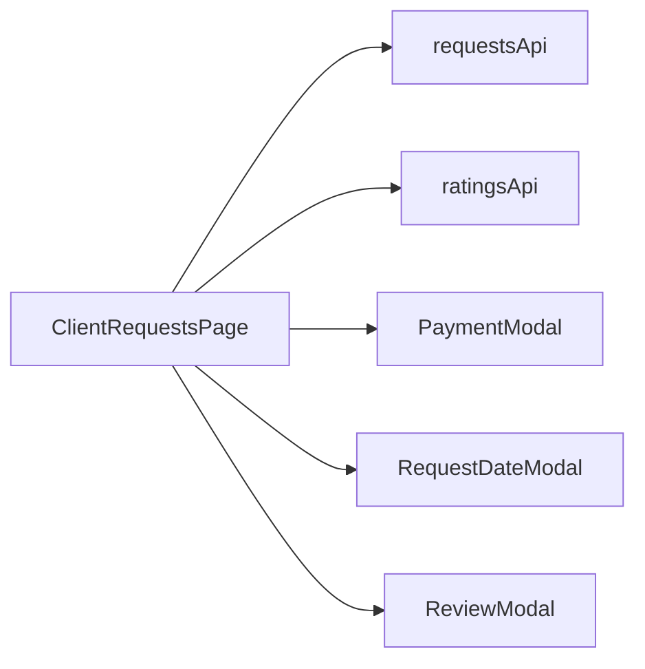

### `ClientMessagesPage.jsx`

Responsabilidad:

- Listar conversaciones del cliente.
- Seleccionar conversación.
- Consultar mensajes periódicamente.
- Enviar mensajes.
- Limpiar selección si la conversación deja de estar autorizada.

Referencias:

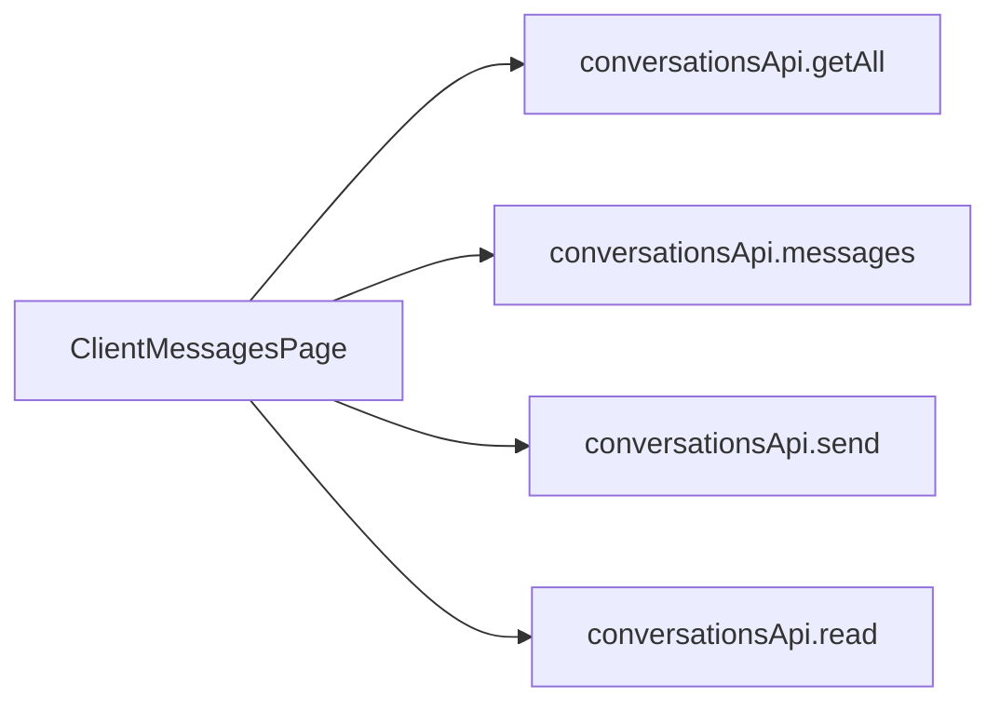

### `ClientFavoritesPage.jsx`

Responsabilidad:

- Listar prestadores favoritos.
- Eliminar favoritos.
- Solicitar servicio desde favoritos.

Referencias:

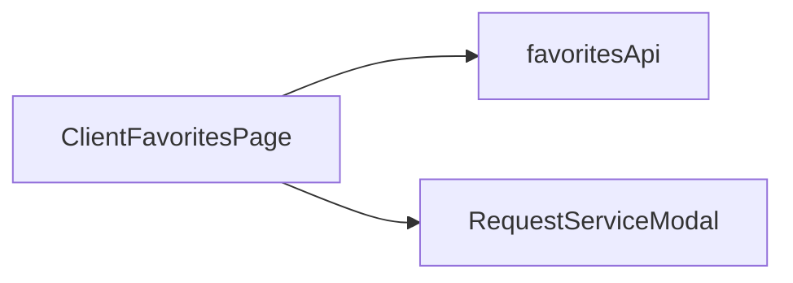

### `ClientProfilePage.jsx`

Responsabilidad:

- Mostrar perfil del cliente.
- Editar teléfono/ubicación.
- Crear direcciones guardadas.
- Mostrar skeleton mientras carga perfil real.

Referencias:

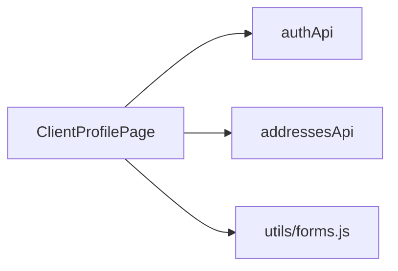

## 9. Módulos Prestador

### `ProviderHomePage.jsx`

Responsabilidad:

- Dashboard de prestador.
- Solicitudes recientes.
- Trabajos activos.
- Resumen de perfil.
- Ganancias semanales.
- Cambiar disponibilidad.

Referencias:

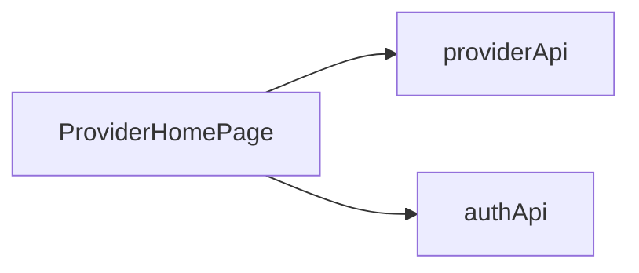

### `ProviderRequestsPage.jsx`

Responsabilidad:

- Mostrar solicitudes pendientes.
- Aceptar solicitud.
- Rechazar solicitud.
- Proponer otra fecha.

Componentes relacionados:

- `ProviderRequestModal`

Referencias:

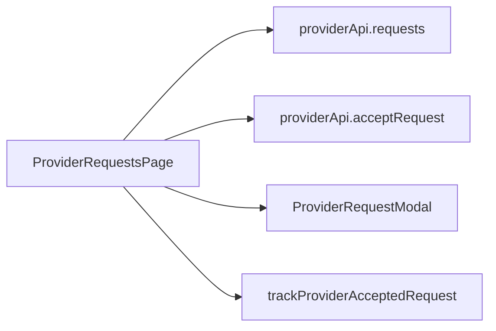

### `ProviderRequestModal.jsx`

Responsabilidad:

- Rechazar solicitud con motivo opcional.
- Proponer nueva fecha.

Referencias:

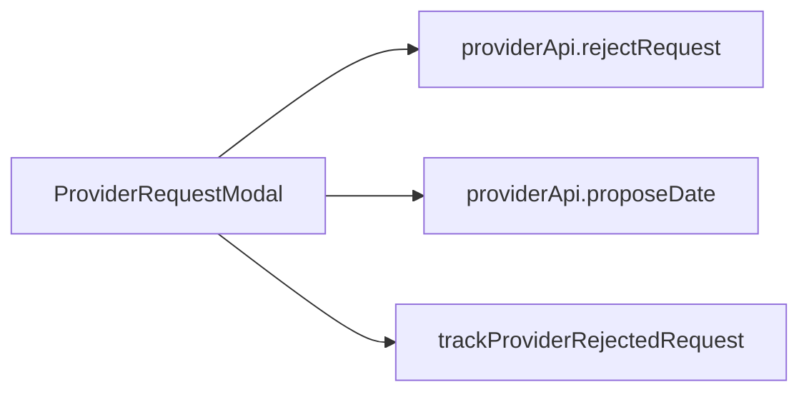

### `ProviderJobsPage.jsx`

Responsabilidad:

- Mostrar trabajos aceptados/en curso.
- Avanzar estado del trabajo.
- Llamar al cliente si existe teléfono.
- Abrir mensajes.

Referencias:

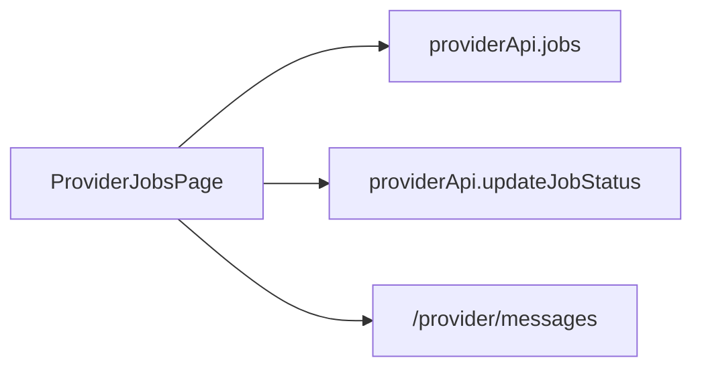

### `ProviderCalendarPage.jsx`

Responsabilidad:

- Mostrar agenda del prestador.

Referencia:

- `providerApi.calendar()`

### `ProviderMessagesPage.jsx`

Responsabilidad:

- Listar conversaciones del prestador.
- Leer y enviar mensajes.
- Limpiar selección si la conversación deja de estar autorizada.

Referencia:

- `conversationsApi`

### `ProviderEarningsPage.jsx`

Responsabilidad:

- Mostrar resumen de ganancias.
- Mostrar transacciones pagadas.

Referencias:

- `providerApi.earnings()`
- `providerApi.transactions()`

### `ProviderReviewsPage.jsx`

Responsabilidad:

- Mostrar reseñas recibidas.
- Mostrar resumen de rating.

Referencia:

- `providerApi.reviews()`

### `ProviderProfilePage.jsx`

Responsabilidad:

- Mostrar perfil profesional.
- Editar especialidad, descripción, experiencia, precio, zona y etiquetas.
- Registrar evento de perfil actualizado.

Referencias:

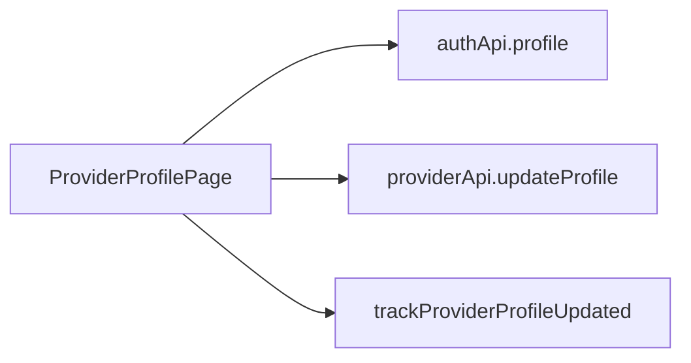

### `ProviderServicesPage.jsx`

Responsabilidad:

- Publicar servicios.
- Editar servicios existentes.
- Pausar/activar servicios.
- Eliminar servicios.

Referencias:

- `authApi.profile()`
- `categoriesApi.getAll()`
- `servicesApi.getAll()`
- `servicesApi.getById()`
- `servicesApi.create()`
- `servicesApi.update()`
- `servicesApi.remove()`

## 10. Servicios API

### `src/services/api.js`

Responsabilidades:

- Centralizar todas las peticiones HTTP.
- Adjuntar token JWT desde `localStorage`.
- Normalizar errores.
- Registrar observabilidad de request/response/error.
- Mantener cache de respuestas `GET`.
- Invalidar cache tras mutaciones.

API expuestas:

| API | Endpoints backend | Consumidores principales |
| --- | --- | --- |
| `authApi` | `/auth/login`, `/auth/register`, `/users/profile` | `App`, perfiles, dashboards |
| `servicesApi` | `/services` | Búsqueda, home, gestión de servicios |
| `categoriesApi` | `/categories` | Home, búsqueda, servicios prestador |
| `dashboardApi` | `/dashboard/client`, `/dashboard/provider` | Layouts y dashboards |
| `requestsApi` | `/requests/*` | Solicitudes cliente, modales |
| `providerApi` | `/provider/*`, `/providers/profile` | Páginas prestador |
| `favoritesApi` | `/favorites/*` | Favoritos y búsqueda |
| `conversationsApi` | `/conversations/*` | Mensajes y layouts |
| `notificationsApi` | `/notifications/*` | Layouts |
| `paymentsApi` | `/requests/:id/payment` | `PaymentModal` |
| `addressesApi` | `/addresses` | Perfil cliente y solicitud |
| `ratingsApi` | `/calificaciones` | Solicitudes cliente |

## 11. Utilidades Transversales

### `utils/formatters.js`

Usado para:

- Moneda.
- Fechas.
- Etiquetas de estado.
- Clases CSS por estado.
- Progreso de trabajos.
- Texto de dirección.

Consumidores frecuentes:

- Solicitudes cliente.
- Trabajos prestador.
- Calendario.
- Ganancias.
- Dashboard.

### `utils/forms.js`

Usado para:

- Sanitizar teléfono.
- Configurar inputs telefónicos.
- Configurar código postal.

Consumidores:

- `RegisterPage`
- `ClientProfilePage`
- `ProviderJobsPage`

### `utils/state.js`

Usado para:

- Comparar datos serializables.
- Evitar `setState` si la respuesta no cambió.
- Reducir renders innecesarios en polling/listas.

Consumidores:

- `App`
- Layouts.
- Dashboards.
- Mensajes.
- Favoritos.
- Perfil.

### `utils/analytics.js`

Usado para:

- Registrar eventos Datadog.
- Sanitizar datos sensibles.
- Registrar errores de API y de React.
- Eventos de negocio.

Consumidores:

- `App`
- `services/api.js`
- `ErrorBoundary`
- Modales y acciones críticas.

## 12. Observabilidad

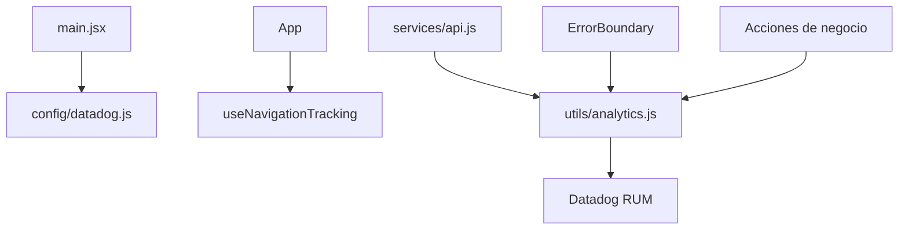

Eventos principales:

| Evento | Origen |
| --- | --- |
| `auth.login` | `App.handleLogin` |
| `auth.register` | `App.handleRegister` |
| `auth.logout` | `App.logout` |
| `api.request` | `apiRequest` |
| `api.response` | `apiRequest` |
| `api.error` | `apiRequest` |
| `client.service_request.created` | `RequestServiceModal` |
| `client.favorite.added` | `ClientSearchPage` |
| `client.review.submitted` | `ReviewModal` |
| `provider.request.accepted` | `ProviderRequestsPage` |
| `provider.request.rejected` | `ProviderRequestModal` |
| `provider.profile.updated` | `ProviderProfilePage` |

## 13. Flujos Principales

### Login

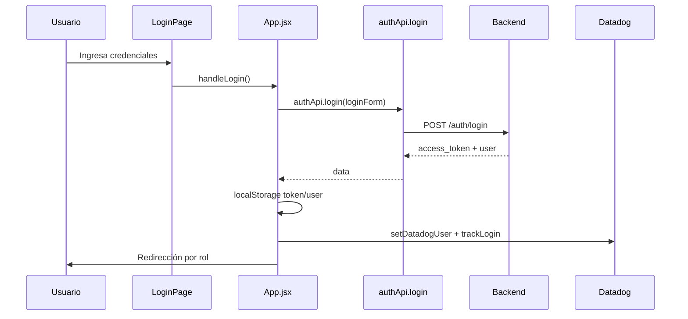

### Solicitud de servicio

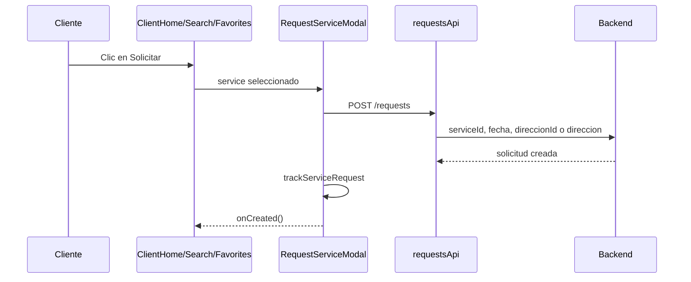

### Pago

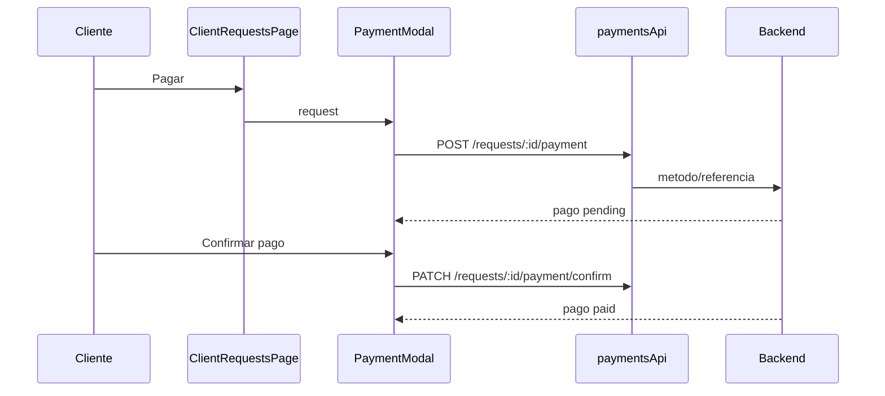

### Mensajes

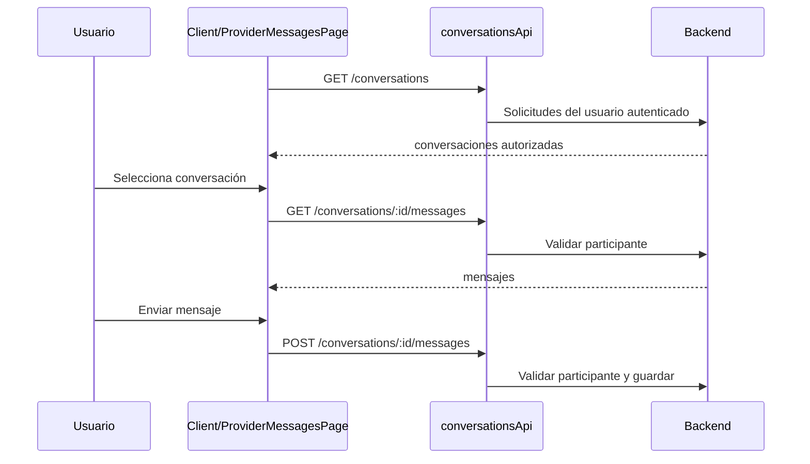

### Prestador acepta solicitud

```mermaid
sequenceDiagram
  participant P as Prestador
  participant Page as ProviderRequestsPage
  participant API as providerApi
  participant B as Backend

  P->>Page: Aceptar
  Page->>API: PATCH /provider/requests/:id/accept
  API->>B: id solicitud
  B-->>Page: solicitud aceptada
  Page->>Page: trackProviderAcceptedRequest
  Page->>API: GET /provider/requests
```

## 14. Dependencias Entre Módulos

### Mapa resumido

```mermaid
flowchart TD
  App --> ClientLayout
  App --> ProviderLayout
  App --> PublicPages["Login/Register"]
  App --> HomePages["ClientHome/ProviderHome"]

  ClientLayout --> ClientPages
  ProviderLayout --> ProviderPages

  ClientPages --> ClientModals["Payment/RequestDate/RequestService/Review"]
  ProviderPages --> ProviderModals["ProviderRequestModal"]

  ClientPages --> ApiService["services/api.js"]
  ProviderPages --> ApiService
  ClientLayout --> ApiService
  ProviderLayout --> ApiService

  ApiService --> Analytics
  App --> Analytics
  ErrorBoundary --> Analytics

  ClientPages --> Formatters
  ProviderPages --> Formatters
  ClientPages --> StateUtils
  ProviderPages --> StateUtils
```

### Dependencias por tipo

| Tipo | Módulos |
| --- | --- |
| Páginas dependen de API | `pages/** -> services/api.js` |
| Layouts dependen de API | `layouts/* -> services/api.js` |
| API depende de observabilidad | `services/api.js -> utils/analytics.js` |
| Observabilidad depende de Datadog | `utils/analytics.js -> config/datadog.js` |
| App depende de rutas y sesión | `App.jsx -> layouts/pages/services/config/hooks/utils` |
| Modales dependen de páginas padre | Las páginas abren modales y reciben callbacks `onCreated/onUpdated` |

## 15. Contratos de Comunicación Interna

### Props relevantes

| Componente | Props | Origen |
| --- | --- | --- |
| `ClientLayout` | `user`, `logout`, `darkMode`, `toggleTheme` | `App.jsx` |
| `ProviderLayout` | `user`, `logout`, `darkMode`, `toggleTheme` | `App.jsx` |
| `ClientHomePage` | `user`, `services`, `servicesLoading`, `loadServices`, `logout`, `darkMode`, `toggleTheme` | `App.jsx` |
| `RequestServiceModal` | `service`, `onClose`, `onCreated` | Home/Search/Favorites |
| `PaymentModal` | `request`, `onClose`, `onCreated` | `ClientRequestsPage` |
| `RequestDateModal` | `request`, `onClose`, `onUpdated` | `ClientRequestsPage` |
| `ReviewModal` | `request`, `onClose`, `onCreated` | `ClientRequestsPage` |
| `ProviderRequestModal` | `request`, `mode`, `onClose`, `onUpdated` | `ProviderRequestsPage` |

## 16. Seguridad y Sesión

| Elemento | Ubicación | Descripción |
| --- | --- | --- |
| Token JWT | `localStorage.chamba_token` | Usado por `apiRequest` para Bearer token |
| Usuario | `localStorage.chamba_user` | Usado por `App` para rutas y rol |
| Protección de rutas | `App.jsx` | Redirige a `/login` si no hay usuario |
| Control real de permisos | Backend | El frontend oculta UI, pero backend autoriza recursos |
| Chats | Backend + frontend | Backend valida participante; frontend limpia selección si pierde autorización |
| Observabilidad | `analytics.js` | Redacta datos sensibles antes de enviarlos |

## 17. Estilos

`src/App.css` importa todos los módulos CSS:

```text
globals.css
auth.css
legacy.css
theme.css
layouts.css
provider-dashboard.css
provider-responsive.css
client-dashboard.css
client-categories.css
shared-dark.css
provider-requests.css
provider-pages.css
provider-jobs.css
provider-earnings.css
provider-reviews.css
provider-services.css
messages.css
provider-calendar.css
profile.css
client-pages.css
client-requests.css
client-messages-dark.css
client-favorites.css
final-overrides.css
```

Regla general:

- Las páginas importan lógica y componentes.
- `App.css` centraliza estilos por módulos CSS.
- `globals.css` contiene reglas compartidas.
- `profile.css` también contiene skeletons reutilizados por varias pantallas.

## 18. Integración con Backend

Base URL:

```env
VITE_API_URL=http://localhost:3000/api
```

El frontend espera que backend exponga:

| Dominio | Endpoints |
| --- | --- |
| Auth | `/auth/login`, `/auth/register` |
| Usuarios | `/users/profile`, `/providers/profile`, `/provider/availability` |
| Servicios | `/services`, `/services/:id`, `/categories` |
| Solicitudes | `/requests`, `/requests/mine`, `/requests/:id/*`, `/provider/requests` |
| Trabajos | `/provider/jobs`, `/provider/jobs/:id/status` |
| Calendario | `/provider/calendar` |
| Pagos | `/requests/:id/payment`, `/requests/:id/payment/confirm` |
| Reseñas | `/requests/:id/review`, `/provider/reviews/summary`, `/calificaciones` |
| Favoritos | `/favorites`, `/favorites/:providerId` |
| Chats | `/conversations`, `/conversations/:id/messages`, `/conversations/:id/read` |
| Notificaciones | `/notifications`, `/notifications/:id` |
| Direcciones | `/addresses` |

## 19. Reglas de Mantenimiento

1. Toda nueva llamada HTTP debe agregarse a `src/services/api.js`.
2. Toda pantalla protegida debe colgar de `ClientLayout` o `ProviderLayout`.
3. Eventos críticos deben usar `utils/analytics.js` para mantener sanitización.
4. Evitar llamadas directas a `fetch` fuera de `api.js`.
5. Para nuevas rutas, actualizar:
   - `App.jsx`
   - `useNavigationTracking.js`
   - este mapa si cambia la arquitectura.
6. Para datos que se refrescan por polling, usar `setStable` cuando aplique.
7. Para inputs sensibles, no registrar valores en analytics.

## 20. Resumen de Acoplamiento

| Módulo | Acoplamiento principal | Riesgo |
| --- | --- | --- |
| `App.jsx` | Alto: rutas, sesión, tema, catálogo inicial | Puede crecer demasiado; separar contexto si escala |
| `services/api.js` | Alto: todas las llamadas HTTP y observabilidad API | Bueno como punto único, pero debe mantenerse ordenado |
| Layouts | Medio: navegación, polling, notificaciones | Cuidar intervalos al agregar más polling |
| Páginas cliente/prestador | Medio: consumen APIs y modales | Evitar duplicar lógica de solicitud/mensajes |
| Observabilidad | Bajo/medio: centralizada | Correcto mientras se mantenga sanitización |

